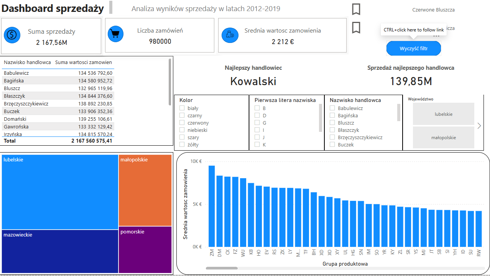

# Power BI Sales Dashboard

Interactive Power BI dashboard created to analyze sales performance between **2012 and 2019**.

## Dashboard Preview

## Project Overview

This dashboard enables users to analyze:

- Sales performance
- Sales representatives
- Product groups
- Regions
- Average order value
- Interactive filtering

## Features

- Interactive slicers
- KPI Cards
- DAX Measures
- Power Query
- Bookmarks
- Drill-through pages
- Treemap
- Bar charts

## Technologies

- Microsoft Power BI
- DAX
- Power Query
- Excel

## Files

- sales dashboard.pbix

- dashboard.png

## Skills demonstrated

- Data Modeling
- DAX
- Data Visualization
- Dashboard Design
- Business Analytics

  ## What I learned

During this project I learned how to:

- Build an interactive Power BI dashboard
- Create DAX measures and KPIs
- Transform data using Power Query
- Design a user-friendly dashboard layout
- Create relationships between tables
- Build an effective data model
- Use slicers, bookmarks and drill-through navigation
- Present business insights through data visualization
- Publish a project on GitHub with professional documentation
